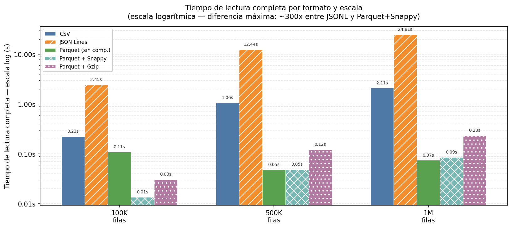
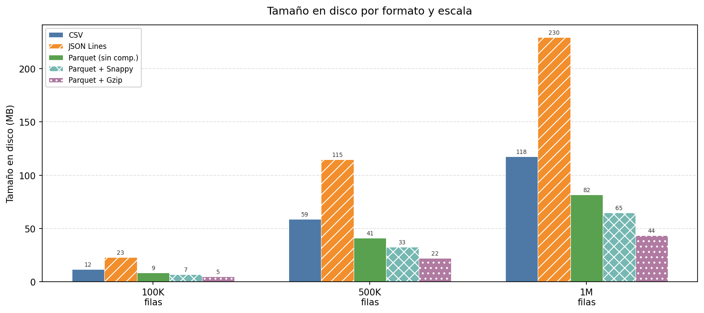
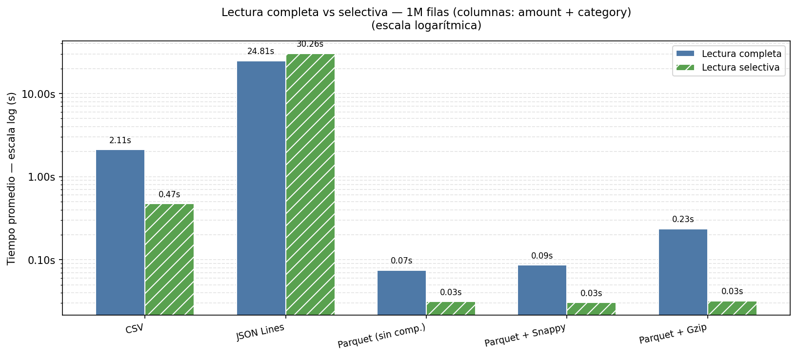
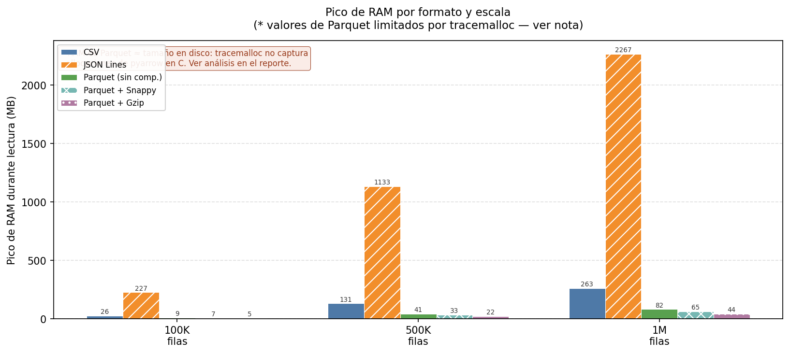

# Reporte — Ejercicio 1: Formatos bajo la lupa

## Cómo reproducir este reporte

```bash
python generate_data.py --size 100k --validate
python generate_data.py --size 500k --validate
python generate_data.py --size 1m   --validate

python benchmark_cli.py --size 100k
python benchmark_cli.py --size 500k
python benchmark_cli.py --size 1m

python generate_report.py
```

---

## Tabla comparativa por escala

### 100 000 filas

> 100,000 filas — promedio de 3 repeticiones. `gc.collect()` antes de cada run.

| Formato | Escritura (avg) | Lectura completa (avg) | Lectura selectiva (avg) | Tamaño en disco | Pico RAM* |
|---------|----------------|------------------------|------------------------|-----------------|----------|
| CSV | 0.230s | 0.225s | 0.054s | 11.8 MB | 26.3 MB |
| JSON Lines | 0.208s | 2.452s | 2.418s | 23.0 MB | 226.6 MB |
| Parquet (sin comp.) | 0.112s | 0.110s | 0.006s | 8.7 MB | 8.9 MB |
| Parquet + Snappy | 0.059s | 0.014s | 0.005s | 7.0 MB | 7.0 MB |
| Parquet + Gzip | 1.103s | 0.031s | 0.006s | 4.8 MB | 4.8 MB |


### 500 000 filas

> 500,000 filas — promedio de 3 repeticiones. `gc.collect()` antes de cada run.

| Formato | Escritura (avg) | Lectura completa (avg) | Lectura selectiva (avg) | Tamaño en disco | Pico RAM* |
|---------|----------------|------------------------|------------------------|-----------------|----------|
| CSV | 1.219s | 1.058s | 0.236s | 58.8 MB | 131.5 MB |
| JSON Lines | 1.037s | 12.438s | 12.322s | 114.8 MB | 1133.4 MB |
| Parquet (sin comp.) | 0.171s | 0.048s | 0.017s | 41.2 MB | 41.4 MB |
| Parquet + Snappy | 0.260s | 0.049s | 0.016s | 32.8 MB | 32.8 MB |
| Parquet + Gzip | 4.905s | 0.123s | 0.017s | 22.1 MB | 22.1 MB |


### 1 000 000 filas

> 1,000,000 filas — promedio de 3 repeticiones. `gc.collect()` antes de cada run.

| Formato | Escritura (avg) | Lectura completa (avg) | Lectura selectiva (avg) | Tamaño en disco | Pico RAM* |
|---------|----------------|------------------------|------------------------|-----------------|----------|
| CSV | 2.211s | 2.108s | 0.471s | 117.6 MB | 262.9 MB |
| JSON Lines | 2.033s | 24.814s | 30.264s | 229.6 MB | 2267.1 MB |
| Parquet (sin comp.) | 0.308s | 0.075s | 0.031s | 81.7 MB | 81.9 MB |
| Parquet + Snappy | 0.457s | 0.086s | 0.031s | 64.8 MB | 64.8 MB |
| Parquet + Gzip | 9.596s | 0.235s | 0.032s | 43.5 MB | 43.5 MB |


---

## Gráficas



> Escala logarítmica porque la diferencia entre JSONL (24.81s) y Parquet+Snappy (0.075s) a 1M filas es de 332x. En escala lineal las barras de Parquet serían invisibles.







---

## Análisis por escala

### Cómo crece el tiempo de lectura al escalar

Al pasar de 100K a 1M filas — exactamente **10x más datos** — los formatos no crecen igual:

| Formato | Lectura 100K | Lectura 1M | Factor de crecimiento |
|---------|-------------|-----------|----------------------|
| CSV | 0.225s | 2.108s | **9.3x** |
| JSON Lines | 2.452s | 24.814s | **10.1x** |
| Parquet + Snappy | 0.014s | 0.086s | **6.3x** |


CSV creció **9.3x** para 10x más datos — casi lineal perfecto. Esto confirma que el parsing byte a byte de CSV escala de forma proporcional al volumen: el doble de bytes, el doble de trabajo, sin excepciones. No hay ninguna optimización que pueda aprovechar la estructura del dato.

Parquet+Snappy creció **6.3x** para los mismos 10x más datos. Escala peor que lineal en términos relativos porque parte de su trabajo (leer el footer del archivo, inicializar el decodificador) es un costo fijo que se amortiza mejor a mayor volumen. La brecha entre CSV y Parquet en términos absolutos se amplía conforme suben los datos: a 100K la diferencia es 17x, a 1M es 24x.


### El problema de escalabilidad de JSON Lines

JSONL tiene el peor comportamiento de todos los formatos al escalar, y no es solo en tiempo, también en memoria. A 1M filas, JSONL requiere **2267 MB de RAM** durante la lectura. Eso es 2.2 GB de memoria solo para leer el archivo.

El motivo es que pandas lee el archivo JSONL completo como texto, construye una estructura intermedia de objetos Python para cada línea, y luego convierte todo a un DataFrame. En CSV este proceso también ocurre, pero la gramática de CSV es más simple y pandas puede hacer streaming del parseo con menos objetos intermedios. En JSONL, cada línea es un objeto JSON completo que requiere su propio árbol de parsing.

En términos prácticos: un servidor con 4 GB de RAM no puede leer un JSONL de 1M filas sin riesgo de OOM. CSV en el mismo escenario usa 263 MB — mucho más manejable.


### El costo de escritura de Parquet+Gzip 

Parquet+Gzip es el único formato donde la escritura se vuelve un problema serio al escalar. A 100K filas tarda 1.103s , lo cual es aceptable. A 1M filas tarda 9.596s — casi **9x más lento** para 10x más datos. Eso es crecimiento casi lineal.

El motivo: el algoritmo DEFLATE que usa Gzip tiene una complejidad que crece con el tamaño del bloque que procesa. Cuando hay más datos, el compresor puede encontrar más coincidencias pero tarda más en buscarlas. Snappy tiene un diseño deliberadamente simple que mantiene un crecimiento casi lineal: a 1M filas tarda 0.457s, apenas 7.7x más que a 100K.


### El tamaño en disco crece linealmente en todos los formatos

A diferencia del tiempo, el tamaño en disco crece de forma predecible. CSV pasa de 11.8 MB a 117.6 MB (10.0x para 10x datos). Parquet+Snappy pasa de 7.0 MB a 64.8 MB (9.2x). Ambos crecen casi exactamente 10x — el tamaño es directamente proporcional al número de filas porque no hay ningún componente de overhead fijo significativo.

Lo que sí cambia es el **ratio de compresión relativo**: a 100K, Parquet+Snappy ocupa 1.7x menos que CSV. A 1M, ocupa 1.8x menos. La ventaja de compresión de Parquet se mantiene constante porque el dictionary encoding es igual de efectivo a cualquier escala siempre que la cardinalidad de las columnas no cambie.


---

## Deciciones tomadas durante el benchmark

- ¿Por que en le benchmark se usan archivos temporales?

El problema idica "Tu equipo los guarda en CSV porque 
siempre lo han hecho asi." por eso al inicio solo creamos los csv y hasta el benckmark se crean los otros formatos, esto simula el escenario real donde el equipo tiene csv y quiere comparar con otros formatos sin modificar su proceso de generación de datos.
ahora, si el equipo decidiera generar los datos directamente en Parquet, el benchmark no tendría sentido porque ya tendrían los archivos listos para medir. El punto del ejercicio es comparar formatos partiendo de un mismo origen (CSV) y midiendo el costo de convertir a otros formatos, no comparar formatos que ya existen sin conocer su costo de generación.
Creamos y borramos cada formato para cada corrida del benchmark para medir el costo real de escritura y no asumir que los archivos ya existen. Esto también nos permite medir el tiempo de escritura, que es un dato importante para la toma de decisiones.

Además  Los archivos temporales se borran para no contaminar mediciones posteriores
Si Parquet+Gzip de 100k quedara en disco, al correr el benchmark de 500k el SO podría tener partes de ese archivo en el page cache y distorsionar los tiempos. Borrar los temporales después de cada medición garantiza que cada run parte de un estado limpio.

La excepción de por qué sí se conservan los Parquet de 1M es también de diseño ya que E2 necesita que DuckDB lea el Parquet directamente desde disco. Si no lo conservas, tendrías que regenerarlo en E2, lo que significaría que E2 depende de correr E1 primero en la misma sesión. 
Al guardarlo en data/ como entregable permanente, 
E2 puede abrirse de forma independiente con solo clonar el repo y correr el benchmark de 1M una vez.

---

## Conclusiones técnicas

### 1. CSV ocupa más espacio del esperado 

Lo primero que noté al ver los resultados fue que CSV a 1M filas pesa **117.6 MB** mientras que Parquet+Gzip pesa **43.5 MB** con exactamente los mismos datos lo que se traduce en una diferencia de **2.7x**. Eso no es una mejora menor, es un formato que ocupa mucho mucho más. Pero ¿de dónde viene esa diferencia?

CSV guarda todo como texto plano. El número `4827.35` se almacena como los caracteres `4`, `8`, `2`, `7`, `.`, `3`, `5` lo que nos da siete bytes. Pero el problema real no está en los números sino en las columnas de texto repetitivo. La columna `category` tiene solo 10 valores posibles: `Food`, `Travel`, `Electronics`, etc. En un CSV de 1M filas, la cadena `"Electronics"` — 11 caracteres — se escribe literalmente en cada una de las ~100.000 filas que le corresponden. Lo mismo con `country_code` (15 valores posibles) y `status` (solo 3 valores: `completed`, `failed`, `pending`). Son cientos de megabytes de texto que se repiten innecesariamente.

Parquet detecta estos patrones automáticamente con algo llamado **dictionary encoding**: analiza cada columna, identifica cuántos valores únicos tiene, y si son pocos los guarda una sola vez en un diccionario al inicio del archivo. Después, en cada fila, en lugar de escribir la cadena `"Electronics"` (11 bytes), escribe el número `3` (1 byte: el índice en el diccionario). A 1M filas, el ahorro en esas tres columnas solas es considerable. Parquet+Gzip suma encima un algoritmo de compresión general que encuentra más patrones repetibles en esos datos ya codificados, llevando el archivo hasta los 43.5 MB.

---

### 2. CSV tarda más en leerse 

El resultado que más me llamó la atención fue el tiempo de lectura. CSV a 1M filas tardó **2.108s**. Parquet+Snappy tardó **0.086s**. Eso es **24x más lento** para el mismo dataset, lo mas sorprendente fue que CSV ni siquiera es el más lento de todos.

La diferencia no viene del tamaño del archivo. Viene de lo que tiene que hacer el sistema para leerlo. Un CSV no tiene estructura interna: es texto con comas. Para extraer un valor de la columna `amount` de la fila 450.000, el parser tiene que leer y procesar todos los bytes anteriores del archivo buscando saltos de línea, contar las comas de cada línea para saber en qué posición está cada campo, y convertir la cadena de texto `"4827.35"` al número de punto flotante `4827.35`. Esa conversión de texto a tipo ocurre para cada una de las 8 millones de celdas del archivo (1M filas × 8 columnas), una por una, de forma secuencial.

Parquet funciona distinto desde el diseño. En el encabezado del archivo guarda un mapa exacto: la posición en bytes donde empieza y termina cada columna, cuántas filas hay, y qué tipo de dato tiene cada columna. Cuando pandas abre un Parquet, lee ese mapa primero y luego va directamente a la posición del dato que necesita. Los valores ya están en formato binario nativo — los números ya son números, las fechas ya son fechas por lo que no hay ninguna conversión. Además puede procesar bloques de valores del mismo tipo con instrucciones SIMD del CPU, que operan sobre múltiples valores simultáneamente en lugar de uno a la vez. El resultado es que leer Parquet a 1M filas cuesta menos de una décima de segundo.

---

### 3. La lectura selectiva es donde la diferencia se vuelve más visible

Si la lectura completa ya mostraba una brecha grande, la lectura selectiva la amplifica más. Al leer solo las columnas `amount` y `category` de 1M filas, CSV tardó **0.471s** y Parquet+Snappy tardó **0.031s** , una ventaja de **15.4x**.

Lo interesante es por qué CSV no mejora más al seleccionar solo dos columnas. SUcede que en un CSV los datos están organizados **por fila**: todos los campos de la transacción 1 están juntos, seguidos de todos los de la transacción 2, y así. Para encontrar el valor de `amount` en la fila 450.000 no hay atajos, hay que leer y parsear todos los campos de todas las filas anteriores, porque las comas que separan columnas y los saltos de línea que separan filas son la única estructura que existe. `usecols=["amount", "category"]` en pandas filtra las columnas después de parsear, no antes de leer del disco.

Parquet organiza los datos **por columna**: primero todos los valores de `transaction_id` de las 1M filas juntos, luego todos los de `timestamp`, luego todos los de `amount`, etc. El footer del archivo tiene el offset exacto donde empieza cada columna. Con `columns=["amount", "category"]`, pandas hace seek directamente a esas dos posiciones y solo lee esos bytes. Las otras 6 columnas nunca tocan la RAM. Con 8 columnas y 2 seleccionadas, Parquet leyó aproximadamente el 25% del archivo; CSV leyó el 100% y descartó el 75% después de parsearlo.

---

### 4. JSON Lines resultó ser el formato más sorprendente (para mal jajaj)

Antes de correr el benchmark, esperaba que JSONL fuera algo más lento que CSV pero comparable. Los números fueron completamente distintos. JSONL a 1M filas tardó **24.814s en lectura**, más de 12x más lento que CSV y consumió **2267 MB de RAM**, es decir, 2.2 GB.

La razón del tiempo es que JSONL es texto plano con una gramática más compleja que CSV. Cada fila es un objeto JSON completo con llaves, dos puntos, comillas alrededor de cada clave y cada valor string. El parser tiene que manejar esa gramática fila por fila, y hacerlo correctamente requiere más trabajo por byte que el parser de CSV. Para la lectura selectiva, el problema se agrava: en JSON Lines no hay forma de saltar directamente al campo `amount` de una línea sin leer la línea completa desde el `{` hasta el `}` — lo que explica que la lectura selectiva de JSONL (30.264s) sea prácticamente igual a la lectura completa (24.814s).

La razón de la RAM merece una nota adicional. Los 2267 MB son reales y están bien medidos: pandas construye cada objeto JSON como estructuras Python en el heap antes de convertirlos al DataFrame, lo que tracemalloc captura correctamente. En cambio, los valores de RAM de Parquet (que aparecen casi idénticos al tamaño en disco) **no son el consumo real**, esto es causa de que  pyarrow hace sus allocaciones en C, fuera del heap de Python y fuera del alcance de tracemalloc. El consumo real de Parquet es mayor que lo reportado, pero no es medible con tracemalloc. La herramienta correcta para eso sería monitorear el RSS del proceso con `psutil` durante la lectura.

---

### 5. Snappy vs Gzip

El último detalle que noté fue la diferencia entre los dos Parquet comprimidos. Parquet+Gzip pesa **43.5 MB**, menor al peso de Parquet+Snappy con **64.8 MB**. Pero en lectura, Snappy tardó **0.086s** y Gzip tardó **0.235s**. Gzip produce un archivo más pequeño pero tarda más en leerse.

La explicación está en dónde está el cuello de botella. Leer un archivo comprimido implica dos pasos: leer bytes del disco y descomprimirlos en RAM. En un sistema con SSD, el primer paso es rápido, los bytes llegan casi de inmediato. El segundo paso, descomprimir, depende del CPU. Snappy fue diseñado explícitamente para ser rápido de descomprimir, sacrificando algo de ratio de compresión. Gzip usa el algoritmo DEFLATE, que encuentra más patrones repetibles y comprime más, pero requiere más ciclos de CPU para hacerlo. En este sistema, el CPU es el cuello de botella, así que Gzip paga un costo extra en tiempo que no compensa el ahorro en bytes leídos.

Si el sistema tuviera un disco lento como un HDD, un volumen de red, o almacenamiento en la nube donde cada byte tiene costo de transferencia la balanza se inclinaría hacia Gzip porque reducir los bytes a leer valdría más que el overhead de CPU. Con SSD local, Snappy gana.

---

## Recomendación de formato para producción

Para transacciones con schema fijo consultadas analíticamente: **Parquet + Snappy** es la mejor propuesta.

- CSV ocupa 5.3x más espacio y es 332x más lento en lectura completa a 1M filas.
- JSONL requiere 2267 MB de RAM a 1M filas — inviable en producción con hardware estándar.
- Parquet+Gzip tarda 9.6s en escritura a 1M filas — inaceptable para pipelines frecuentes.
- Parquet+Snappy combina lectura rápida (0.086s), escritura rápida (0.457s), y tamaño razonable (64.8 MB). Es el estándar de facto en Spark, BigQuery y Athena por exactamente estos motivos.
